# Winpea World
(Developer: Lewis Hazelwood)

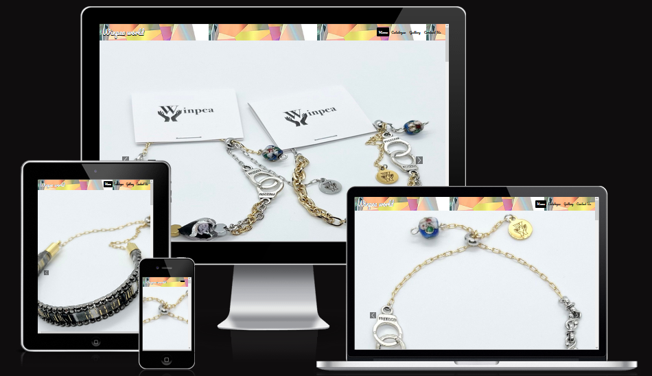

[Live Webpage](https://lewishaz.github.io/CI_PP1_WINPEA_2/)

## Table of Contents

1. [Project Goals](#project-goals)
    1. [User Goals](#user-goals)
    2. [Site Owner Goals](#site-owner-goals)
2. [User Experience](#user-experience)
    1. [Target Audience](#target-audience)
    2. [User Requirements & Expectations](#user-requirements-&-expectations)
    3. [User Stories](#user-stories)
3. [Design](#design)
    1. [Design Choices](#design-choices)
    2. [Colour](#colours)
    3. [Fonts](#fonts)
    4. [Structure](#structure)
    5. [Wireframes](#wireframes)
4. [Technologies Used](#technologies-used)
    1. [Languages](#languages)
    2. [Frameworks & Tools](#frameworks-&-tools)
5. [Features](#features)
6. [Testing](#validation)
    1. [HTML Validation](#HTML-validation)
    2. [CSS Validation](#CSS-validation)
    3. [Accessibility](#accessibility)
    4. [Performance](#performance)
    5. [Device testing](#performing-tests-on-various-devices)
    6. [Browser compatibility](#browser-compatability)
    7. [Testing user stories](#testing-user-stories)
7. [Bugs](#bugs)
8. [Deployment](#deployment)
9. [Credits](#credits)
10. [Acknowledgements](#acknowledgements)

## Project Goals

### User Goals
- To find a jewellery & fashion department store in their area that offers value for money and fashionable designs.
- See a catalogue of products on offer at the store with item descriptions & prices.
- Find information about opening times and the location of the store.
- Find out about Delivery options.

### Site Owner Goals
- Promote the brand and increase sales globally.
- Build loyalty with customers and therefore increase the customer base.
- Provide port of contact for new & existing customers.
- Give out important information to the customers.
- Build an image and identity for the brand that is easily recognisable.

## User Experience

### Target Audience
- People looking to buy fashion products from their local area (in our case Leeds city centre).
- People looking to buy jewellery or fashion presents for their loved ones (e.g. anniversairy gifts).
- People looking to buy themselves new accessories for their wardrobe.
- Models looking to increase their popularity with accessories from a known brand.
- Other likeminded companies looking to collaborate on fashion projects.

### User Requirements & Expectations
- An inituitive website that allows the user to seamlessly navigate the site.
- Can easily find the information they're looking for.
- All the features/elements work correctly (links, forms, embeded sections etc).
- Visually appealing and works across all devices.
- Content that is easily readable.
- Information regarding the business can be found and used to contact the store.

### User Stories

#### First-time User
1. As a first time user, I want to know where the store is located.
2. As a first time user, I want to know what products are available.
3. As a first time user, I want to know more about the brand and its history.
4. As a first time user, I want to who works for the business.
5. As a first time user, I want to know if the brand delivers to my location.

#### Returning User
6. As a returning user, I want to know about the brand's vision and intentions.
7. As a returning user, I want to know what time the store times.
8. As a returning user, I want to know if there is other delivery options.
9. As a returning user, I want to know if there is any discounts or sales.
10. As a returning user, I want to find the brand's social media.
11. As a returning user, I want to get visual directions for the store (live in the area but got delivery last time)
12. As a returning user, I want to give feedback to the brand.

#### Site Owner
13. As the site owner, I want users to find products they would like to buy.
14. As the site owner, I want users to understand the identity of the brand.
15. As the site owner, I want users to easily find the store.
16. As the site owner, I want users to be able to contact us at any time and by any means.

## Design

### Design Choices
- The design choice for the website was to be based around the colour & shine that a diamond provides, this is actually
the navbar & footer background itself but it has been repeated in order to fill the width of the webpage.

- I wanted to use this diamond shine effect across many elements on the website, so I included it within the imagery on the home
page to represent a ring shape around the team members that I've put there.
 

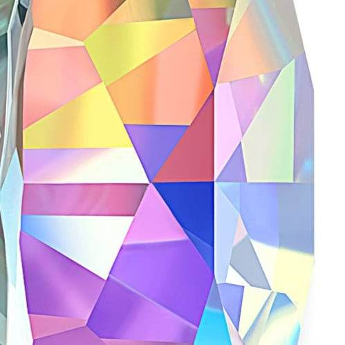

### Colour
The colour scheme for the website was to follow the brand logo's simple black and white; and thus I have kept all the writing and font elements
contrast so the readability is high. These simple colours mesh very well with the diamond design I've chosen and allow the imagery to pop out.

### Fonts
Pacifico used for the headings & nav bar elements with Sans Serif & cursive as a fallback.
 
Libre Baskerville used as the main body font and Serif used as a fallback.

### Structure
Each webpage on the site is created so that the user can be easily familiarised with what content they are looking at. There is a navigation bar, with the brand logo aligned to the left side and the page links on the right. The structure allows user to easily pick out what content they are searching for, the pages are as follows:

- A landing page with sections consisting of carousel images, welcome section & meet the staff section.
- A catalogue page with a list of products the company makes.
- A gallery page with a panel of various images encompassing many aspects of the brand.
- A contact us page with a contact form, an image to visualise the store location, a map and contact details.

### Wireframes

Home

Catalogue

Gallery

Contact Us

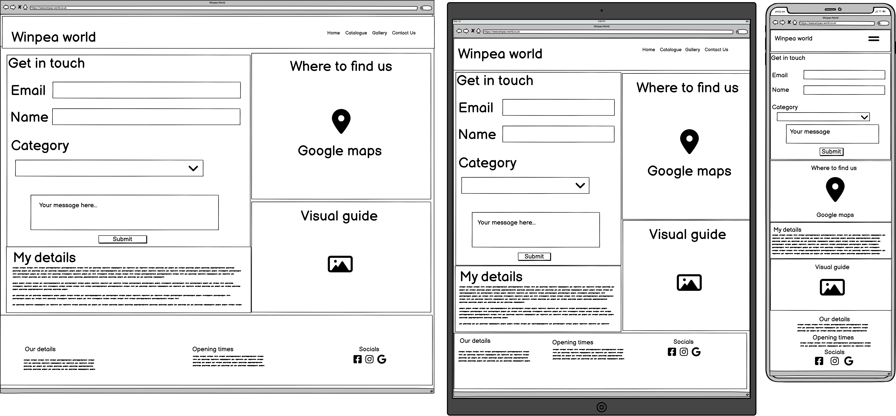

## Technologies Used

### Languages
- HTML
- CSS
- Javascript

### Frameworks & Tools
- Bootstrap v5.0.2
- Git
- GitHub
- Gitpod
- Paint
- Balsamiq
- Google Fonts
- Font Awesome
- Favicon

## Features
The Winpea World website is made up of 4 pages & x features.

Brand Logo & Navigation Bar
- Consistent across all pages.
- The brand logo can be clicked to return to the home page.
- The navigation bar is responsive and uses a hamburger toggler for mobile sized screens, it includes the links for each page.
- The navigation bar allows fluid access to each page.
- The current page is represented with a rounded black square background.

Carousel
- Showcases some of the brand's work in a 4 photo slide show.
- The user can choose which slide to view by using the back and forward arrows as well as the slide indicators at the bottom center.

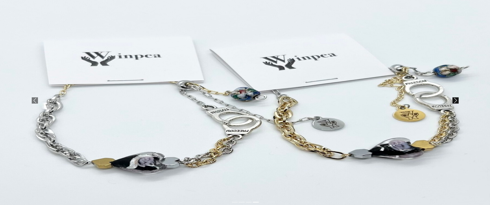

Welcome
- This section gives the user a brief description of many aspects of the company.
- A quote from the brand owner to give the brand identity.
- Quality & Delivery guarantees in order to build trust.
- All of these brought together with a brand photo and large heading welcoming users at the top.

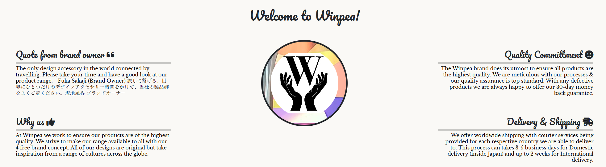

Meet the team
- The next section on the homepage introduces users to the staff working at Winpea World.
- Each member's profile is broken up with a line stretching the width of the window.
- The profile's also alternate from left to right, twice respectively & in that order.

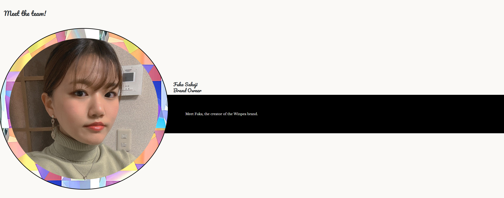
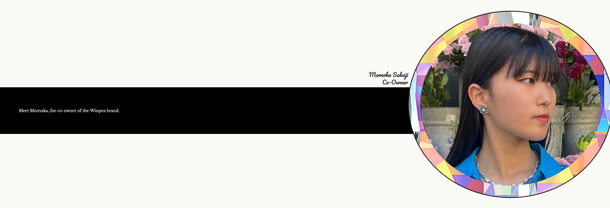
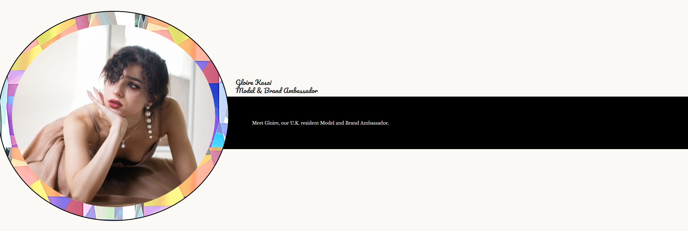
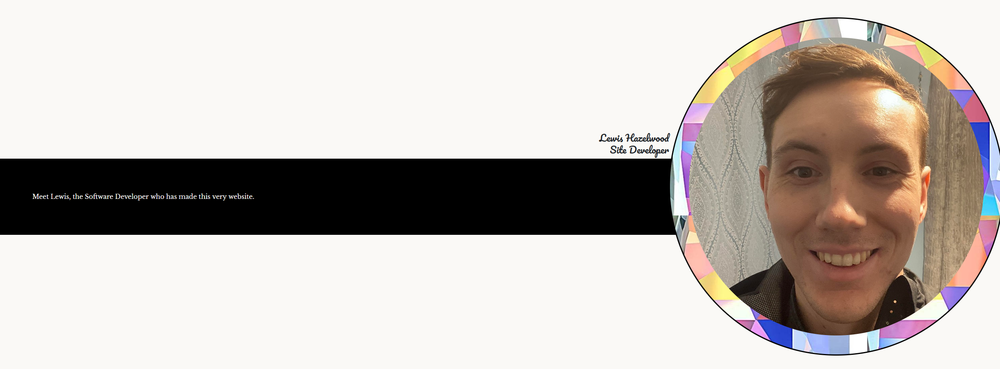

History
- Gives a brief overview of the brand's inspirations, when the brand was founded and who the biggest influence on the direction of the brand is plus their store location.
- An image pushed to the right showing the Liberty London department store included too.

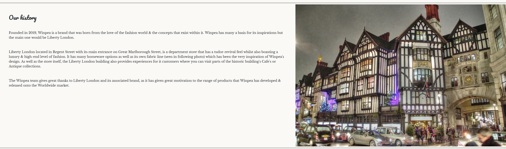

Brand Mission statement
- A statement of intent from the CEO of the brand, includes an itallic font style to highlight importance whilst also making the writing pop with a black background.

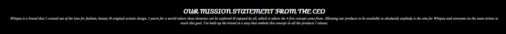

Liberty influence
- A quote from the original owner of the Liberty brand, the quote is to reinforce the direction of the brand.

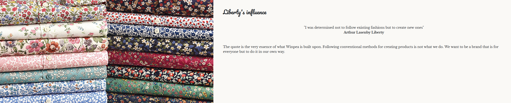

Footer
- Included on all pages for consistency and ease of access.
- Diamond design also used for the footer background, same as the navigation bar & other imagery.
- Three sections included: Information for location/contact number, Opening times of the store & social media links.

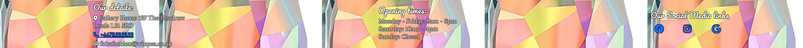

Back to Top button
- Included on the Home & Catalogue pages: I have deemed these pages to be scrolling-intensive across all devices.
- To ease the strain for each user and to decrease the chance of them leaving the website I have included the back to top button.
- The button will return the user back to the very top of the page when pressed and can be pressed whenever the user scrolls and is not at the top of the page.

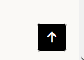

Catalogue
- A selection of Winpea's best products collated onto one page.
- Each product includes a name, price tag and an image.
- A cart icon is included on each in the top left of the image.

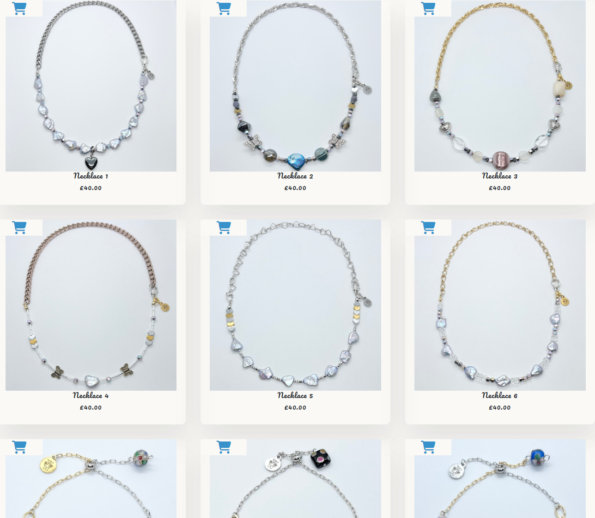

Our Vision
- A short paragraph on the bottom of the catalogue page which thanks customers for visiting.
- An affirmation of Winpea's quality of operations, reaching across Europe and the globe.

Gallery
- A selection of photos for the brand arrange in a row.
- Each photo is split but you're able to focus on each one.

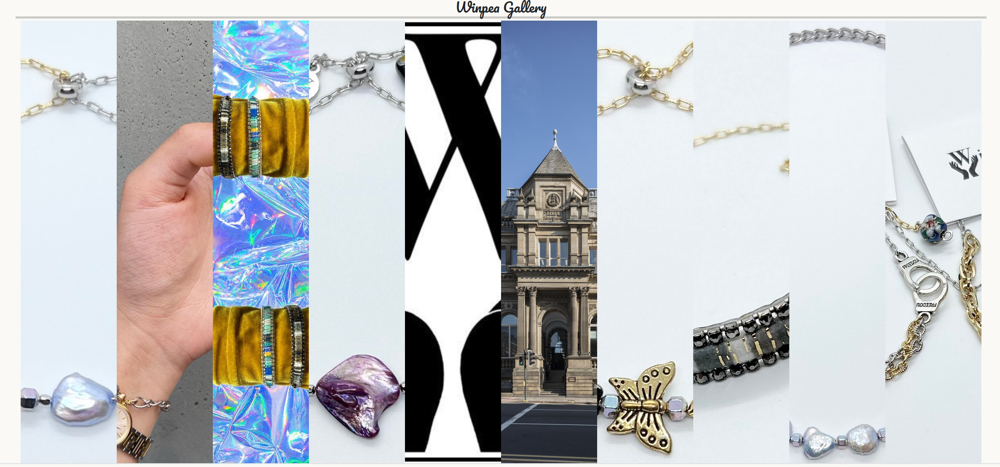

Youtube Promo video
- A YouTube video to showcase the brand's exploration of the globe and research.

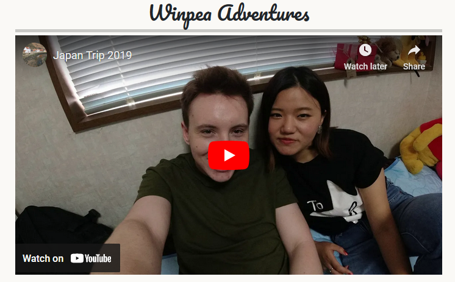

Contact form
- A feature to allow the user to provide feedback to the brand.

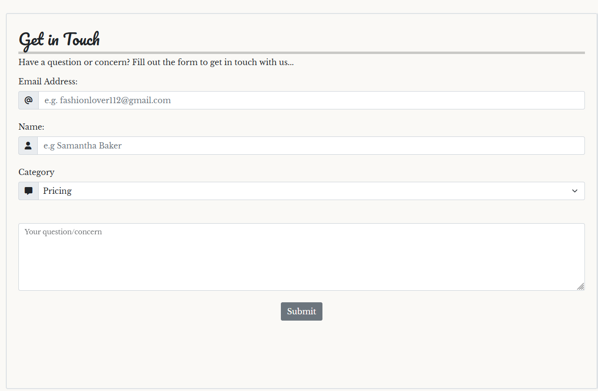

Map (store location)
- Google maps embeded into the contact us page, gives directions to the user.

Details/Information
- Gives the user the information they need to contact the brand owner.

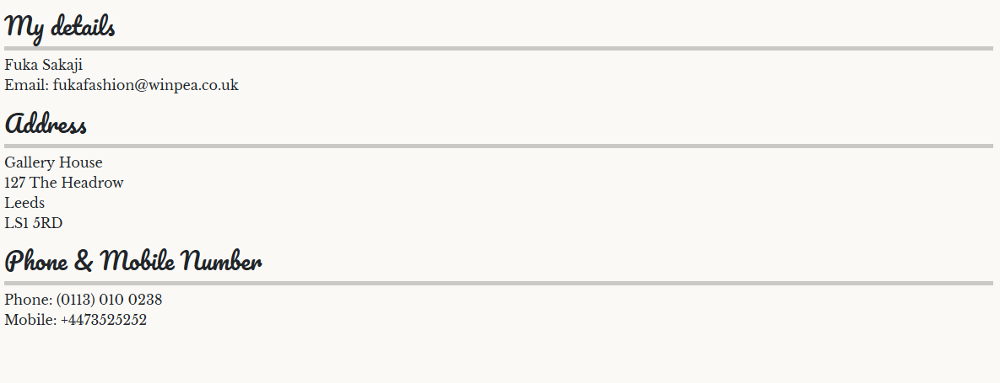

Store Location Image
- An image that showcases the location of the store's building.

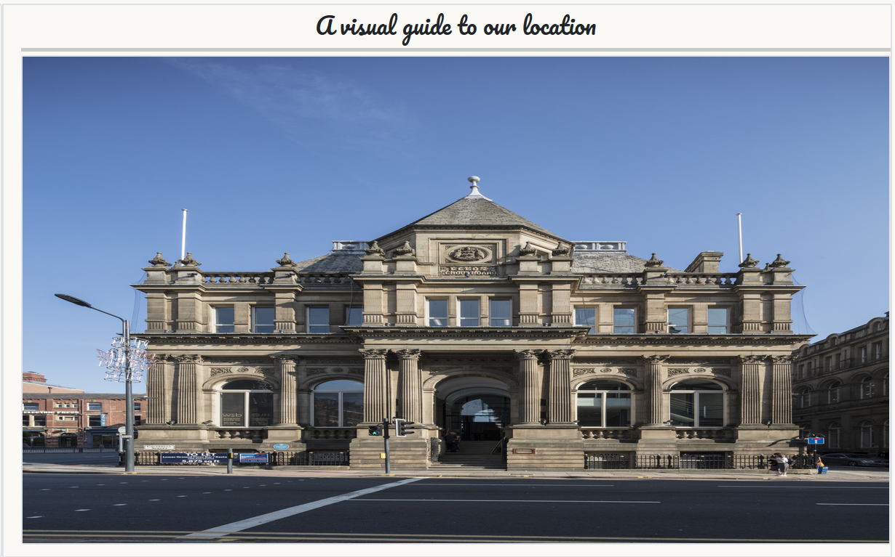