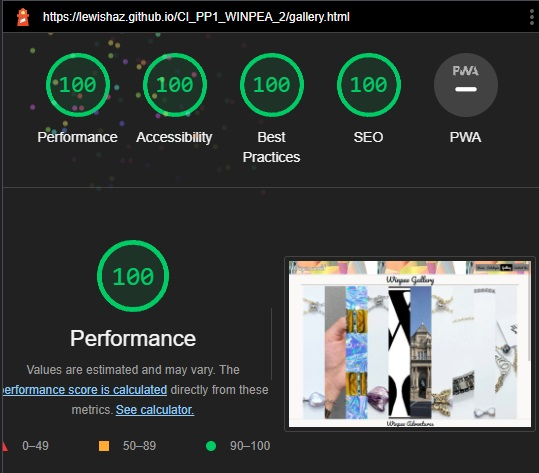
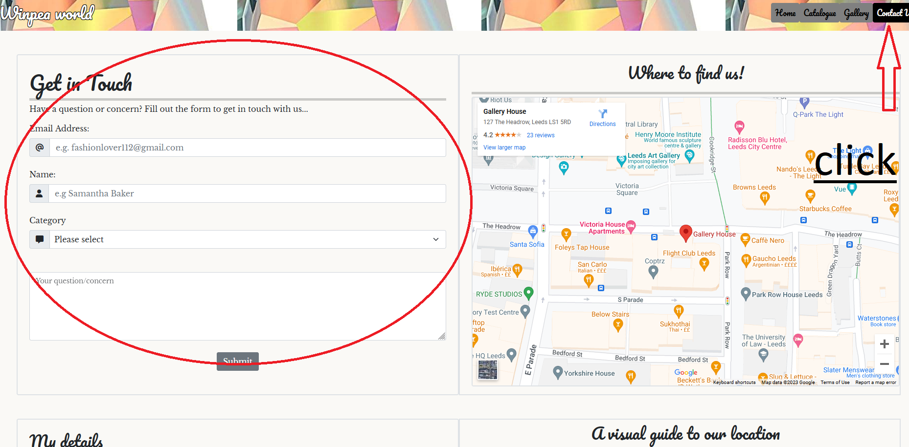
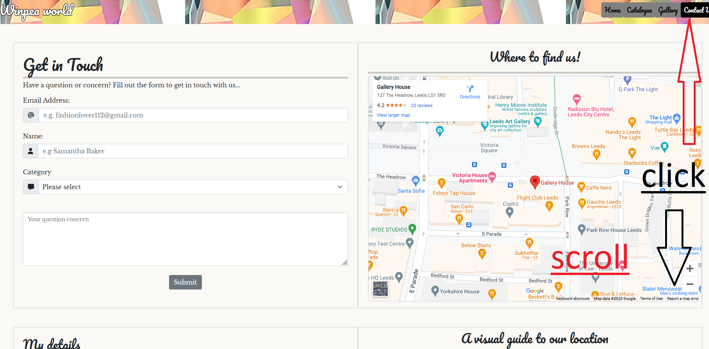
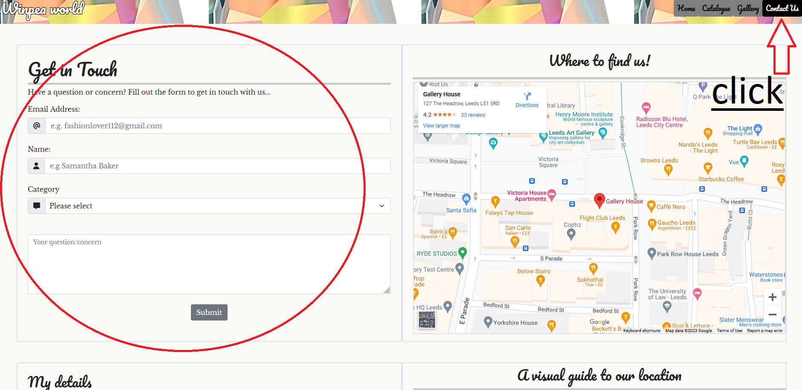

# Winpea World
(Developer: Lewis Hazelwood)

[Live Webpage](https://lewishaz.github.io/CI_PP1_WINPEA_2/)

## Introduction
Hello and welcome to the Read me documentation for my PP1 Project, named: Winpea World. This website is the foundation for an E-Commerce website which I intend to 
build upon in the future projects of mine. The theme of the site itself is a Jewellery & Fashion brand; one that hopes to bring audiences from all across the globe, 
with British and Japanese cultures being the main driving point for the design of each product. The design of the site is colorful yet not too overpowering, so as to give a vibrant feel with a calmness to the tones of each page as the user progresses through the site.

### User manual 
The website itself has been designed in such a way that it works in different ways depending on which device(s) the user is on. For example: on Windows or iMac devices, the Gallery page will have a hover & zoom effect for the images that user chooses to look at. Whereas on mobile and tablets devices, the images need to be clicked on in order for the user to be able to focus on a specific image within the set. Design choices such as this one have been done in order to keep the viewing experience fluid but also so as to not overpower and disorientate the user.

## Table of Contents

1. [Project Goals](#project-goals)
    1. [User Goals](#user-goals)
    2. [Site Owner Goals](#site-owner-goals)
2. [User Experience](#user-experience)
    1. [Target Audience](#target-audience)
    2. [User Requirements and Expectations](#user-requirements-and-expectations)
    3. [User Stories](#user-stories)
3. [Design](#design)
    1. [Design Choices](#design-choices)
    2. [Colour](#colour)
    3. [Fonts](#fonts)
    4. [Structure](#structure)
    5. [Wireframes](#wireframes)
4. [Technologies Used](#technologies-used)
    1. [Languages](#languages)
    2. [Frameworks & Tools](#frameworks-and-tools)
5. [Features](#features)
6. [Testing](#validation)
    1. [HTML Validation](#HTML-validation)
    2. [CSS Validation](#CSS-validation)
    3. [Accessibility](#accessibility)
    4. [Performance](#performance)
    5. [Device testing](#testing-on-different-devices)
    6. [Browsers](#browsers)
    7. [Testing user stories](#testing-user-stories)
7. [Bugs](#bugs)
8. [Deployment](#deployment)
9. [Credits](#credits)
10. [Thanks to](#thanks-to)

## Project Goals

### User Goals
- To find a jewellery & fashion department store in their area that offers value for money and fashionable designs.
- See a catalogue of products on offer at the store with item descriptions & prices.
- Find information about opening times and the location of the store.
- Find out about Delivery options.

### Site Owner Goals
- Promote the brand and increase sales globally.
- Build loyalty with customers and therefore increase the customer base.
- Provide port of contact for new & existing customers.
- Give out important information to the customers.
- Build an image and identity for the brand that is easily recognisable.

## User Experience

### Target Audience
- People looking to buy fashion products from their local area (in our case Leeds city centre).
- People looking to buy jewellery or fashion presents for their loved ones (e.g. anniversairy gifts).
- People looking to buy themselves new accessories for their wardrobe.
- Models looking to increase their popularity with accessories from a known brand.
- Other likeminded companies looking to collaborate on fashion projects.

### User Requirements and Expectations
- An inituitive website that allows the user to seamlessly navigate the site.
- Can easily find the information they're looking for.
- All the features/elements work correctly (links, forms, embeded sections etc).
- Visually appealing and works across all devices.
- Content that is easily readable.
- Information regarding the business can be found and used to contact the store.

### User Stories

#### First-time User
1. As a first time user, I want to know where the store is located.
2. As a first time user, I want to know what products are available.
3. As a first time user, I want to know more about the brand and its history.
4. As a first time user, I want to who works for the business.
5. As a first time user, I want to know if the brand delivers to my location.

#### Returning User
6. As a returning user, I want to know about the brand's vision and intentions.
7. As a returning user, I want to know what time the store times.
8. As a returning user, I want to know if there is other delivery options.
9. As a returning user, I want to find the brand's social media.
10. As a returning user, I want to get visual directions for the store (live in the area but got delivery last time)
11. As a returning user, I want to give feedback to the brand.

#### Site Owner
12. As the site owner, I want users to find products they would like to buy.
13. As the site owner, I want users to understand the identity of the brand.
14. As the site owner, I want users to easily find the store.
15. As the site owner, I want users to be able to contact us at any time and by any means.
16. As the site owner, I don't want user to have to use the back button in order to go back a page if they hit a 404 error accidentally.

## Design

### Design Choices
- The design choice for the website was to be based around the colour & shine that a diamond provides, this is actually
the navbar & footer background itself but it has been repeated in order to fill the width of the webpage.

- I wanted to use this diamond shine effect across many elements on the website, so I included it within the imagery on the home
page to represent a ring shape around the team members that I've put there.
 

### Colour
The colour scheme for the website was to follow the brand logo's simple black and white; and thus I have kept all the writing and font elements
contrast so the readability is high. These simple colours mesh very well with the diamond design I've chosen and allow the imagery to pop out.

### Fonts
Pacifico used for the headings & nav bar elements with Sans Serif & cursive as a fallback.
 
Libre Baskerville used as the main body font and Serif used as a fallback.

### Structure
Each webpage on the site is created so that the user can be easily familiarised with what content they are looking at. There is a navigation bar, with the brand logo aligned to the left side and the page links on the right. The structure allows user to easily pick out what content they are searching for, the pages are as follows:

- A landing page with sections consisting of carousel images, welcome section & meet the staff section.
- A catalogue page with a list of products the company makes.
- A gallery page with a panel of various images encompassing many aspects of the brand.
- A contact us page with a contact form, an image to visualise the store location, a map and contact details.

### Wireframes

Home

Catalogue

Gallery

Contact Us

404

## Technologies Used

### Languages
- HTML
- CSS
- Javascript

### Frameworks and Tools
- Bootstrap v5.0.2
- Git
- GitHub
- Gitpod
- Paint
- Balsamiq
- Google Fonts
- Font Awesome
- Favicon

## Features
The Winpea World website is made up of 4 pages & 17 features.

### Brand Logo & Navigation Bar
- Consistent across all pages.
- The brand logo can be clicked to return to the home page.
- The navigation bar is responsive and uses a hamburger toggler for mobile sized screens, it includes the links for each page.
- The navigation bar allows fluid access to each page.
- The current page is represented with a rounded black square background.

### Carousel
- Showcases some of the brand's work in a 4 photo slide show.
- The user can choose which slide to view by using the back and forward arrows as well as the slide indicators at the bottom center.

### Welcome
- This section gives the user a brief description of many aspects of the company.
- A quote from the brand owner to give the brand identity.
- Quality & Delivery guarantees in order to build trust.
- All of these brought together with a brand photo and large heading welcoming users at the top.
- User stories covered: 6

### Meet the team
- The next section on the homepage introduces users to the staff working at Winpea World.
- Each member's profile is broken up with a line stretching the width of the window.
- The profile's also alternate from left to right, twice respectively & in that order.
- User stories covered: 4, 5

### History
- Gives a brief overview of the brand's inspirations, when the brand was founded and who the biggest influence on the direction of the brand is plus their store location.
- An image pushed to the right showing the Liberty London department store included too.
- User stories covered: 3, 6

### Brand Mission statement
- A statement of intent from the CEO of the brand, includes an itallic font style to highlight importance whilst also making the writing pop with a black background.
- User stories covered: 6, 13

### Liberty influence
- A quote from the original owner of the Liberty brand, the quote is to reinforce the direction of the brand.
- User stories covered: 3, 13

### Footer
- Included on all pages for consistency and ease of access.
- Diamond design also used for the footer background, same as the navigation bar & other imagery.
- Three sections included: Information for location/contact number, Opening times of the store & social media links.
- User stories covered: 1, 7, 9, 15

### Back to Top button
- Included on the Home & Catalogue pages: I have deemed these pages to be scrolling-intensive across all devices.
- To ease the strain for each user and to decrease the chance of them leaving the website I have included the back to top button.
- The button will return the user back to the very top of the page when pressed and can be pressed whenever the user scrolls and is not at the top of the page.

### Catalogue
- A selection of Winpea's best products collated onto one page.
- Each product includes a name, price tag and an image.
- A cart icon is included on each in the top left of the image.
- User stories covered: 2, 12

### Our Vision
- A short paragraph on the bottom of the catalogue page which thanks customers for visiting.
- An affirmation of Winpea's quality of operations, reaching across Europe and the globe.
- User stories covered: 6, 13

### Gallery
- A selection of photos for the brand arrange in a row.
- Each photo is split but you're able to focus on each one.
- User stories covered: 13

### Youtube Promo video
- A YouTube video to showcase the brand's exploration of the globe and research.
- User stories covered: 13

### Contact form
- A feature to allow the user to provide feedback to the brand.
- User stories covered: 11, 15

### Map (store location)
- Google maps embeded into the contact us page, gives directions to the user.
- User stories covered: 1, 14

### Details/Information
- Gives the user the information they need to contact the brand owner.
- User stories covered: 1, 4, 5, 11, 15

### Store Location Image
- An image that showcases the location of the store's building.
- User stories covered: 1, 10, 14

### 404 Page
- A page that the user is brought to if they accidentally type an unknown address into the address bar.
- User stories covered: 16

## Validation

### HTML Validation
The W3C Markup Validation Service was used to validate the HTML code for the webiste. All pages have passed the checks and have no errors - this can be checked at any time.
- index.html [results](https://validator.w3.org/nu/?doc=https%3A%2F%2Flewishaz.github.io%2FCI_PP1_WINPEA_2%2Findex.html) - No Errors Found
- catalogue.html [results](https://lewishaz.github.io/CI_PP1_WINPEA_2/catalogue.html) - No Errors Found
- gallery.html [results](https://validator.w3.org/nu/?doc=https%3A%2F%2Flewishaz.github.io%2FCI_PP1_WINPEA_2%2Fgallery.html) - No Errors Found
- form.html [results](https://validator.w3.org/nu/?doc=https%3A%2F%2Flewishaz.github.io%2FCI_PP1_WINPEA_2%2Fform.html)  - No Errors Found
- 404.html [results](https://validator.w3.org/nu/?doc=https%3A%2F%2Flewishaz.github.io%2FCI_PP1_WINPEA_2%2F404.html) - No Errors Found
### CSS Validation
The W3C Jigsaw CSS Validation Service was used to validate the CSS code for the website.

Entire page

style.css

### Accessibility
The WAVE WebAIM web accessibility evaluation tool was used to make sure the website ticked all accessiblity boxes. All pages passed with zero errors but there was an alert for the YouTube video included on the gallery page due to no captions.

Home

Catalogue

Gallery

Contact us

### Performance
Google Lighthouse within the Google Chrome Developer Tools was used to test the overall performance of the website.

Home

Catalogue

Gallery

Contact us

### Testing on different devices
The website and all pages have been tested on many devices, including:
- iPhone 10
- Galaxy S22

### Browsers
The website has also been tested on various browsers, including:
- Google Chrome
- Mozilla Firefox
- Microsoft Edge

### Testing User stories
1. As a first time user, I want to know where the store is located

| **Feature** | **Action** | **Expected Result** | **Actual Result** |
|-------------|------------|---------------------|-------------------|
| Map | Navigate to the Contact Us page, locate the Google Maps | Locating a map showing the location of the store | Works as expected |
| Footer - contact information section | On any page scroll down to the footer | Find the address of the store | Works as expected |

Evidence of

2. As a first time user, I want to know what products are available.

| **Feature** | **Action** | **Expected Result** | **Actual Result** |
|-------------|------------|---------------------|-------------------|
| Catalogue | Navigate to the Catalogue page and product section | Find the products available with images/prices | Works as expected |
| Carousel images | Load up Home page | Immediately presented with brief range of products | Works as expected |

Evidence of

3. As a first time user, I want to know more about the brand and its history.

| **Feature** | **Action** | **Expected Result** | **Actual Result** |
|-------------|------------|---------------------|-------------------|
| History | Navigate to the Home page | Scroll down to the lower section and find brief brand history | Works as expected |

Evidence of

4. As a first time user, I want to who works for the business.

| **Feature** | **Action** | **Expected Result** | **Actual Result** |
|-------------|------------|---------------------|-------------------|
| Meet team | Navigate to the Home page | Scroll down to the middle section and find introductions to each Winpea team member | Works as expected |
| My details | Navigate to the Contact us page | Locate the name of the brand owner | Works as expected |

Evidence of

5. As a first time user, I want to know if the brand delivers to my location.

| **Feature** | **Action** | **Expected Result** | **Actual Result** |
|-------------|------------|---------------------|-------------------|
| Welcome | Navigate to the Home page | Scroll down to the top section and find the delivery & shipping guarantee | Works as expected |

Evidence of

6. As a returning user, I want to know about the brand's vision and intentions.

| **Feature** | **Action** | **Expected Result** | **Actual Result** |
|-------------|------------|---------------------|-------------------|
| Our Vision | Navigate to the Catalogue page | Scroll down to the bottom section below the products and find the our vision section | Works as expected |

Evidence of

7. As a returning user, I want to know what time the store times.

| **Feature** | **Action** | **Expected Result** | **Actual Result** |
|-------------|------------|---------------------|-------------------|
| Footer - opening times section | On any of the pages you can scroll to the footer | See opening times | Works as expected |

Evidence of

8. As a returning user, I want to know if there is other delivery options.

| **Feature** | **Action** | **Expected Result** | **Actual Result** |
|-------------|------------|---------------------|-------------------|
| Contact us - submit feedback or a question | Navigate to the Contact us page | Fill in the contact form and submit a question | Works as expected |

Evidence of

9. As a returning user, I want to find the brand's social media.

| **Feature** | **Action** | **Expected Result** | **Actual Result** |
|-------------|------------|---------------------|-------------------|
| Footer - social media links section | On any of the pages you can scroll to the footer | See social media | Works as expected |

Evidence of

10. As a returning user, I want to get visual directions for the store.

| **Feature** | **Action** | **Expected Result** | **Actual Result** |
|-------------|------------|---------------------|-------------------|
| Contact us - visual image | Navigate to the Contact us page | See visual directions in the bottom section | Works as expected |

Evidence of

11. As a returning user, I want to give feedback to the brand.

| **Feature** | **Action** | **Expected Result** | **Actual Result** |
|-------------|------------|---------------------|-------------------|
| Contact us - submit feedback or a question | Navigate to the Contact us page | Fill in the contact form with the feedback | Works as expected |
| My details | Navigate to the Contact us page | Locate the name of the brand owner and send an email or make a call | Works as expected |

Evidence of

12. As the site owner, I want users to find products they would like to buy.

| **Feature** | **Action** | **Expected Result** | **Actual Result** |
|-------------|------------|---------------------|-------------------|
| Catalogue | Navigate to the Catalogue page and product section | Find the products available with images/prices | Works as expected |
| Carousel images | Load up Home page | Immediately presented with brief range of products | Works as expected |

Evidence of

13. As the site owner, I want users to understand the identity of the brand.

| **Feature** | **Action** | **Expected Result** | **Actual Result** |
|-------------|------------|---------------------|-------------------|
| Meet team | Navigate to the Home page | Scroll down to the middle section and find introductions to each Winpea team member | Works as expected |
| Home - mission statement | Navigate to the home page and mission statement section | Find the mission statement wrote by the CEO | Works as expected |
| History | Navigate to the Home page | Scroll down to the lower section and find brief brand history | Works as expected |
| Our Vision | Navigate to the Catalogue page | Scroll down to the bottom section below the products and find the our vision section | Works as expected |

Evidence of

14. As the site owner, I want users to easily find the store.

 | **Feature** | **Action** | **Expected Result** | **Actual Result** |
|-------------|------------|---------------------|-------------------|
| Footer - Our details | On any of the pages you can scroll to the footer | see address | Works as expected |
| Map | Navigate to the Contact Us page, locate the Google Map | Locating a map showing the location of the store | Works as expected |

Evidence of

15. As the site owner, I want users to be able to contact us at any time and by any means.

| **Feature** | **Action** | **Expected Result** | **Actual Result** |
|-------------|------------|---------------------|-------------------|
| Contact us - My details | Navigate to the Contact us page | Locate the name of the brand owner and send an email or make a call | Works as expected |
| Footer - Our details | On any of the pages you can scroll to the footer | email or call the number | Works as expected |
| Contact us - submit feedback or a qusetion | Navigate to the Contact us page | Fill in the contact form with the feedback | Works as expected |

Evidence of

16. As the site owner, I don't want user to have to use the back button in order to go back a page if they hit a 404 error accidentally.

| **Feature** | **Action** | **Expected Result** | **Actual Result** |
|-------------|------------|---------------------|-------------------|
| 404 page - accessibility| Get 404 error through typing incorrect address | Locate the back to home button and return to website | Works as expected |

Evidence of

## Bugs

| **Bug** | **Fix** |
| ----------- | ----------- |
| Images not appearing on deployed sites | Link images correctly using full deployed website file paths |
| YouTube video overflow into the footer | Reduced the height of the element |
| Back to top button not appearing | Adjust the z-index value of the class to appear above all page elements |
| YouTube video showing inverted colour | Remove the inverted class which was affecting all iframe tags |
| Overflow to the right side of the viewport | Use overflow hidden on the x-axis |

## Deployment
The website was deployed using GitHub Pages by following these steps:
1. In the GitHub repository navigate to the Settings tab
2. On the left hand menu select Pages
3. For the source select Branch: master
4. After the webpage refreshes automaticaly you will see a ribbon on the top saying: "Your site is published at https://lewishaz.github.io/CI_PP1_WINPEA_2/"

You can for fork the repository by following these steps:
1. Go to the GitHub repository
2. Click on Fork button in upper right hand corner

You can clone the repository by following these steps:
1. Go to the GitHub repository 
2. Locate the Code button above the list of files and click it 
3. Select if you prefere to clone using HTTPS, SSH, or Github CLI and click the copy button to copy the URL to your clipboard
4. Open Git Bash
5. Change the current working directory to the one where you want the cloned directory
6. Type git clone and paste the URL from the clipboard ($ git clone https://github.com/YOUR-USERNAME/YOUR-REPOSITORY)
7. Press Enter to create your local clone.

## Credits
Images not referenced below are owned by the developer.

### Media
- [Liberty London building](assets/images/liberty-london.jpg): Photo by <a href="https://www.libertylondon.com/uk/department/home/">Liberty London</a>
- [Liberty Materials](assets/images/libert-london-material.jpg):  Photo by <a href="https://www.libertylondon.com/uk/department/home/">Liberty London</a>
- [Diamond shine effect](assets/images/diamond-effect.jpg): Photo from John Hazelwood sent via Messenger
- [Bag 1](assets/images/placeholder-bag-1.jpeg): Photo by <a href="https://www.pexels.com/photo/old-fashioned-handbag-with-metal-handle-6044266/">Skylar Kang on Pexels</a>
- [Bag 2](assets/images/placeholder-bag-2.jpeg): Photo by <a href="https://www.pexels.com/photo/round-straw-bag-on-cement-floor-6045068/">Skylar Kang on Pexels</a>
- [Bag 3](assets/images/placeholder-bag-3.jpeg): Photo by <a href="https://www.pexels.com/photo/trendy-leather-bag-on-black-background-5462562/">Dominika Roseclay on Pexels</a>
- [Earrings 1](assets/images/placeholder-earrings-1.jpeg): Photo by <a href="https://www.pexels.com/photo/golden-hoop-earrings-neat-white-ribbon-9211671/">BKA photos on Pexels</a>
- [Earrings 2](assets/images/placeholder-earrings-2.jpeg): Photo by <a href="https://www.pexels.com/photo/earring-with-diamonds-in-close-up-shot-7509251/">Gra.Wal on Pexels</a>
- [Earrings 3](assets/images/placeholder-earrings-3.jpeg): Photo by <a href="https://www.pexels.com/photo/gold-colored-earrings-on-white-background-3881077/">SEASHELL IN LOVE on Pexels</a>
- [Visual Directions](assets/images/visual-reference-store.jpg): Photo by <a href="https://property.jll.co.uk/rent-office/office-rent-leeds-ls1-5rd-17387?variant=1">JLL Properties</a>
- [404 error image](assets/images/404-error-img.jpg): Taken from <a href="https://www.freepik.com/free-vector/404-error-with-portals-concept-illustration_20602756.htm#page=3&query=404&position=3&from_view=search&track=sph">Freepik.com</a>

### Code
- The HTML for the responsive [Navbar with toggler](https://getbootstrap.com/docs/5.0/components/navbar/#toggler) was taken from the Bootstrap v5.0 documentation code snippet and combined with their [Navbar with Pills](https://getbootstrap.com/docs/5.0/components/navs-tabs/#pills)
- [Carousel](https://getbootstrap.com/docs/5.0/components/carousel/#with-indicators) on index page was taken from Bootrap v5.0 documentation code snippet.
- [Gallery Slider](https://youtu.be/73DfC_HKLGc) on Gallery page was taken from Code Grind on YouTube.

## Thanks to 
I'd like to thank: 
- Mo Shami, my mentor for the project for his guidance and additional support.
- The Code Institute Slack community.
- My parents for giving me the push I needed to start this course.
- My Fiancee who owns the brand that inspired this website.